# Live Kronprins Haakon positions in QGIS

A tutorial for showing live ship positions from underway data feeds on *FF Kronprins Haakon*, a Norwegian research icebreaker collaboratively operated by the Norwegian Polar Institute, Institute for Marine Research, and the Arctic University in Tromsø.

## Overview

While aboard *FF Kronprins Haakon*, a live ship position feed can be added to a QGIS map window using the PosiView plugin. This plugin reads a ship position feed broadcast over the ship local network and configures a marker to display on the map.

## Install QGIS

Skip this if you already have QGIS v3 or higher (current is 3.18.x).

1. Go to https://qgis.org/en/site/forusers/download.html
2. Follow instructions to install the latest release of QGIS

This requires local adminstrator rights on your computer, hopefully you have those.

## Install the PosiView plugin

PosiView can be installed using the QGIS plugin manager. Head to 'plugins -> manage and install plugins'

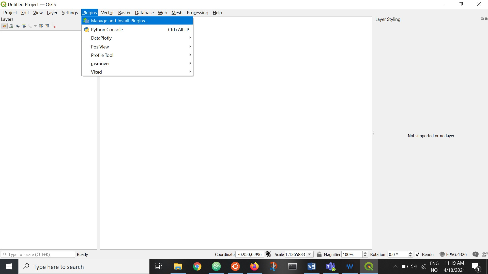

Search for PosiView, and press 'install'.

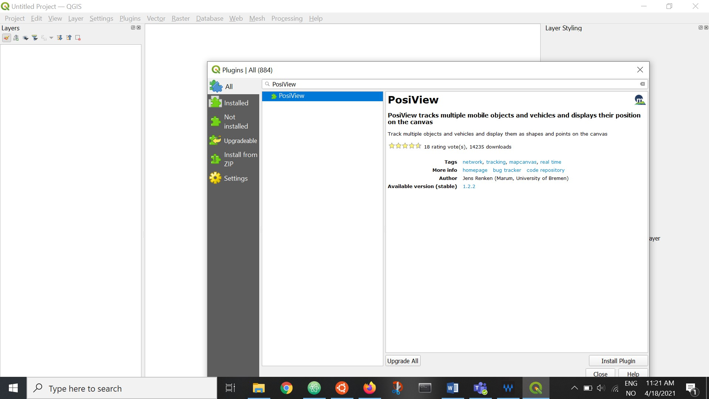

QGIS will let you know if it was successful, and some posiview panels will show up:

Exit the plugin manager.

## Configure PosiView for Kronprins Haakon

QGIS should now show a PosiView toolbar - it might be in a slightly different place on your window. Once found, click the 'Enable PosiView' icon.

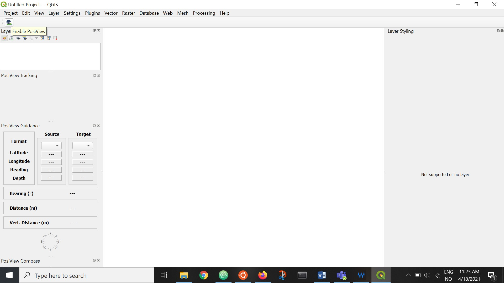

Some new icons will appear in the posiview toolbar. Click the 'configure PosiView' icon:

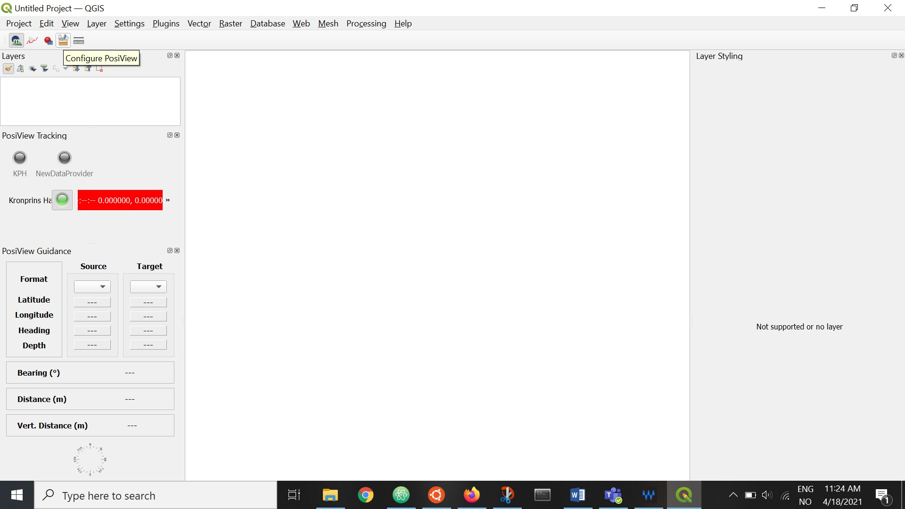

First set up a data provider. This is where your data source is configured. Create a new one by clicking the green plus icon, then configure it as shown:

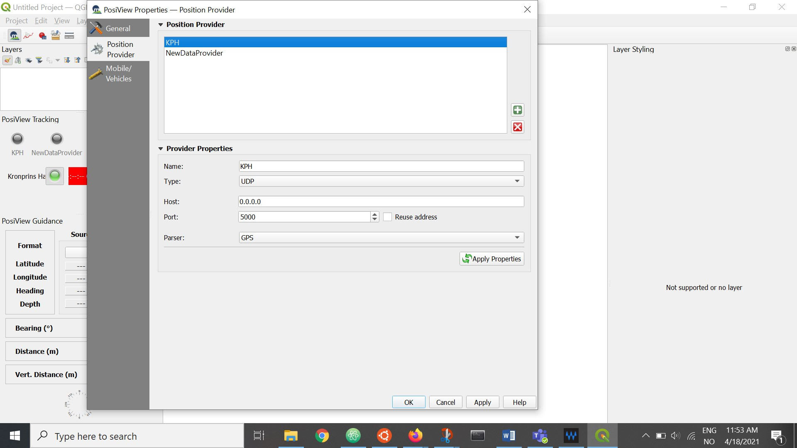

**Click 'apply' after every change you want to keep**

Next set up a marker. This will be shown on the map once position data are available. Again press the green + to make a new one, and click apply after your changes. Here - just experiment to see what looks good on your map!

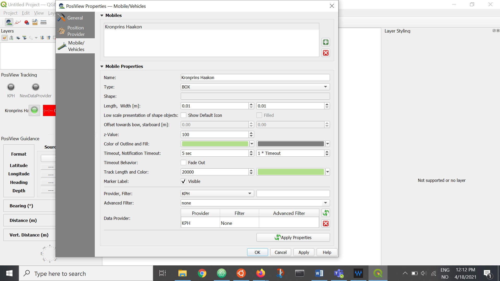

That's all you need to get going. Click OK to get out of the PosiView dialogue box and get back to QGIS.

To start tracking, click the `start tracking` button in the PosiView Toolbar:

If you are on *Kronprins Haakon* plugged into the network this should show the vehicle icon you configured on your map view. If not, it will result in an error message.

### Things that might go wrong

If nothing shows up on the ship, check that:
- your provider is configured correctly. The settings shown here are copied from a working configuration on Q1, themselves a copied from the installation used by bridge crew. They should just work...
- you selected the correct provider in your vehicle marker settings
- you are plugged into the wired KPH network
- your windows firewall allows network traffic on port 5000

## Adding map data

On Kronprins Haakon, I will set up a folder called 'QGISdata' in fjelles. There you will find:
- the bathymetry map you see in the example here, made from IBCAOv4 and Gebco datasets, merged and coloured.
- a copy of the Natural Earth 10m coastline and country boundaries as shapefiles
- a GeoJSON file containing points for Nansen Legacy stations P1-P7
- a GeoJSON file showing the Norway/Russia marine boundary

All of these files can be dragged and dropped into your QGIS map window.

P station position and marine boundary positions are here in the `kph-map-data` in this repository

### Adding an ocean floor layer

Drag and drop `gebco-ibcaov4.tiff` into your map window.'

Set the map projection to NSIDC North Polar stereographic:

If you want north to be up, use the `rotation` setting - much faster than reprojecting the map:

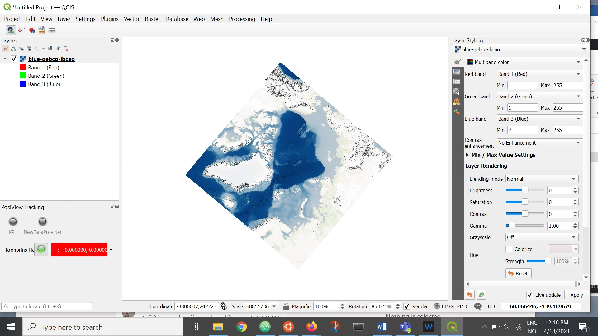

### Adding the marine boundary

Same as P stations - drag and drop the geojson file, style as you see fit. It has no labels:

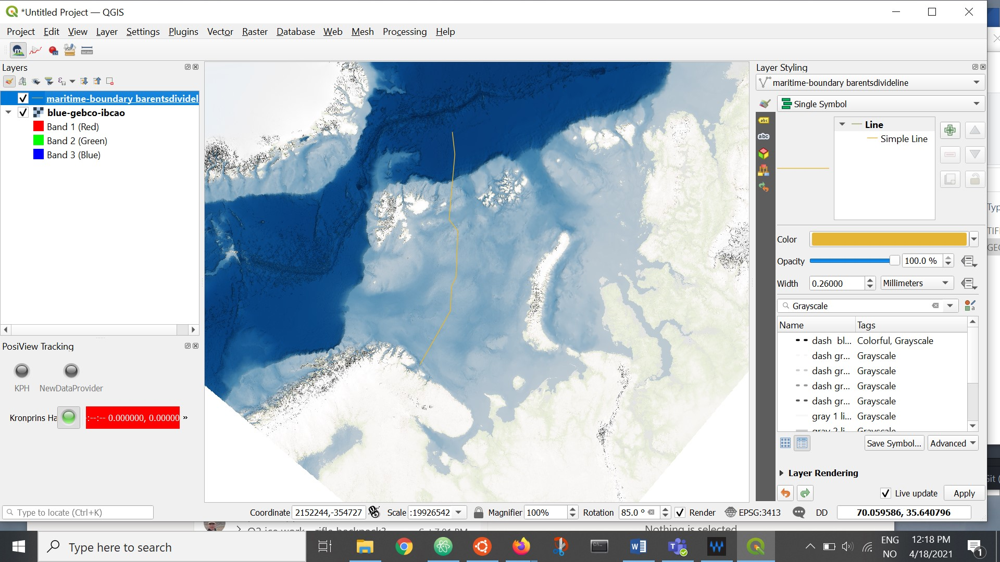

### Adding Nansen Legacy P stations

Drag and drop P1-P7.geojson into the map window.

Display labels if you want to:

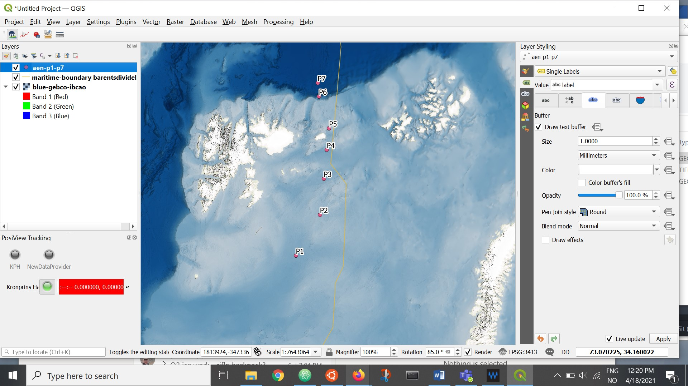

### It is still an ugly map...

yes, land masses are just weird white blobs. Natural Earth polygons can help - so we will add some. Press ctrl+shift+v to open the 'add vector layer' dialog and navigate to where we have the data (on the ship, likely in `fjelles\QGISdata\naturalearth`) and select the file ending in `.shp`:

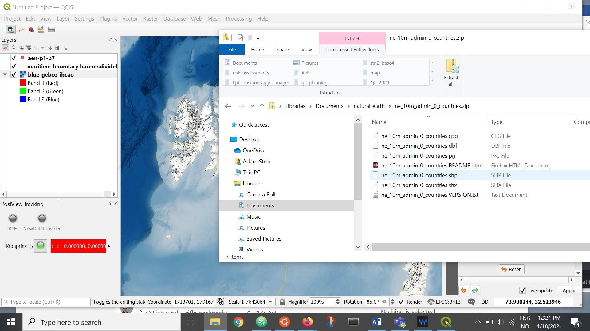

 ...and then style it a bit - in the layer styling panel to the right you can see the settings used here:

 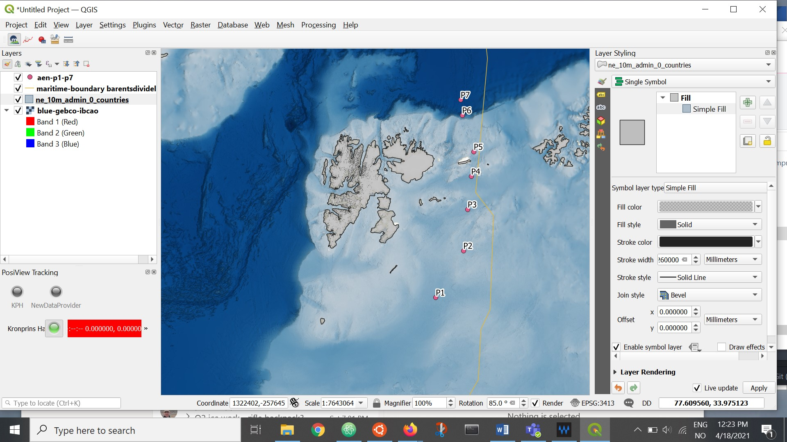

## Summary

Hopefully this is enough information to help you get live positions from *FF Kronprins Haakon* while underway, so you can create awesome maps with your own data and figure out where we are in relation to stuff you're interested in.

Once we get on board, feel free to track me down and ask questions if it isn't working for you.

### Random useful tips

**ctrl-shift-f** is a keyboard shortcut for toggling full window map display. If you want to quickly drop all the menus and toolbars from view and just see the map or show it on your full screen without clutter, use this. Be aware that sometimes it forgets to re-display all the toolbars and panels you had open before.

**you can zoom to a layer** by right clicking any layer in the layer panel and selecting 'zoom to extent'. Super useful for focussing a work area.
