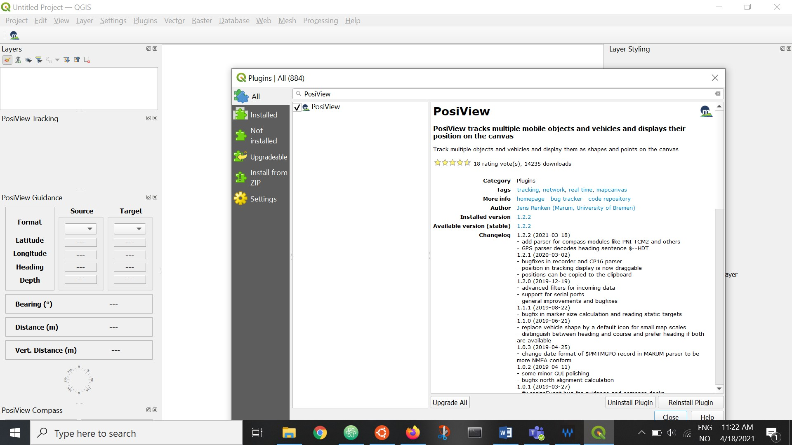

# Live Kronprins Haakon positions in QGIS

A tutorial for showing live ship positions from underway data feeds on *FF Kronprins Haakon*, a Norwegian research icebreaker collaboratively operated by the Norwegian Polar Institute, Institute for Marine Research, and the Arctic University in Tromsø.

## Overview

While aboard *FF Kronprins Haakon*, a live ship position feed can be added to a QGIS map window using the PosiView plugin. This plugin reads a ship position feed broadcast over the ship local network and configures a marker to display on the map.

## Install QGIS

Skip this if you already have QGIS v3 or higher (current is 3.18.x).

1. Go to https://qgis.org/en/site/forusers/download.html
2. Follow instructions to install the latest release of QGIS

This requires local adminstrator rights on your computer, hopefully you have those.

## Install the PosiView plugin

PosiView can be installed using the QGIS plugin manager. Head to 'plugins -> manage and install plugins'

Search for PosiView, and press 'install'.

QGIS will let you know if it was successful, and some posiview panels will show up:

Exit the plugin manager. Back in QGIS, click the 'Enable PosiView' icon.

Some new icons will appear in the posiview toolbar. Click the 'configure PosiView' icon:

First set up a data provider. This is where your data source is configured. Create a new one by clicking the green plus icon, then configure it as shown:

**Click 'apply' after every change you want to keep**

Next set up a marker. This will be shown on the map once position data are available.

## Adding map data

On Kronprins Haakon, I will set up a folder called 'QGISdata' in fjelles. There you will find:
- the bathymetry map you see in the example here, made from IBCAOv4 and Gebco datasets, merged and coloured.
- a copy of the Natural Earth 10m coastline and country boundaries as shapefiles
- a GeoJSON file containing points for Nansen Legacy stations P1-P7
- a GeoJSON file showing the Norway/Russia marine boundary

All of these files can be dragged and dropped into your QGIS map window.

### Setup

Here is how I have my desktop for making maps:

### Adding an ocean floor layer

Drag and drop `gebco-ibcaov4.tiff` into your map window.'

Set the map projection to NSIDC North Polar stereographic:

If you want north to be up, use the `rotation` setting - much faster than reprojecting the map.

### Adding Nansen Legacy P stations

Drag and drop P1-P7.geojson into the map window.

Display labels if you want to:

### Adding the marine boundary

Same as P stations - drag and drop the geojson file, style as you see fit. It has no labels

## Useful parts

**ctrl-shift-f** is a keyboard shortcut for toggling full window map display. If you want to quickly drop all the menus and toolbaors from view and just see the map, use this. Be aware that sometimes it forgets to re-display all the toolbars and panes you had open before.
